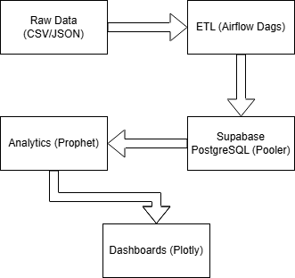

# 🚀 E-commerce Analytics Platform

## 📊 Overview
End-to-end analytics platform for e-commerce data processing, from raw data to business insights.

## 🏗️ Architecture
Raw Data → ETL Pipeline → Supabase PostgreSQL DB (Pooler) → Analytics & Forecasting → Real-time Dashboards.



## 📋 Setup
1. Clone repo
2. Set up .env with Supabase credentials
3. Create venv & pip install -r requirements.txt
4. Run ETL & dashboards

## 🚀 Quick Start (One Command)

```bash
# Clone the repository
git clone https://github.com/yourusername/ecommerce-analytics-platform.git
cd ecommerce-analytics-platform

# Run one-click deployment (Linux / macOS / WSL)
./start_platform.sh
```

On Windows PowerShell use the Python deployer:

```powershell
# One-command deployment (Windows)
python scripts/deploy_platform.py all
```

## 🗄️ Metabase (Optional)

To run Metabase locally with Docker Compose:

```bash
docker-compose -f docker-compose.metabase.yml up -d
# Then configure via the API helper
python scripts/setup_metabase.py
```

## 🔧 Manual Setup

1. Prerequisites

```text
- Docker & Docker Compose
- Python 3.9+
- AWS/GCP account (for RDS) or local PostgreSQL
- Git
```

2. Database Setup

```bash
# Create .env file
cp .env.example .env
# Edit .env with your database credentials

# Create schema and load sample data
python scripts/create_schema.py
python scripts/run_etl.py
```

3. Start Services

```bash
# Start Apache Airflow
docker-compose -f docker-compose.airflow.yml --env-file .env.airflow up -d

# Start Metabase
docker-compose -f docker-compose.metabase.yml up -d
```

4. Access Dashboards

```text
Airflow:    http://localhost:8080  (default: admin/admin)
Metabase:   http://localhost:3000  (admin@ecommerce.com / EcommerceAdmin2025!)
Reports:    reports/index.html
```

## 📊 Dashboard Features

- Executive Dashboard: Real-time revenue tracking, product performance, acquisition metrics
- Customer Analytics: Cohort retention, CLTV, segmentation
- Product Analytics: Demand forecasting, inventory signals, margin analysis
- Marketing Analytics: Campaign ROI, funnel conversion, A/B testing results

## 🔄 Automated Pipelines (Schedules)

- Daily Pipeline (2:00 AM): incremental data generation, data quality checks, daily KPIs, materialized views, email report
- Weekly Pipeline (Mon 03:00 AM): weekly aggregates, performance reports, cleanup, segment updates
- Monthly Pipeline (1st 04:00 AM): demand forecasting, clustering, A/B analysis, monthly reports, backups

## 🚀 Deployment Options

Local Development

```bash
./start_platform.sh
```

Cloud Deployment (AWS)

```bash
# Deploy to AWS Elastic Beanstalk (example)
eb init -p docker ecommerce-analytics
eb create ecommerce-prod
eb deploy
```

Docker Swarm / Kubernetes

```bash
# Docker Swarm
docker stack deploy -c docker-compose.prod.yml ecommerce

# Kubernetes
kubectl apply -f kubernetes/
```

## 📚 Documentation

- Architecture Design
- Database Schema
- API Documentation
- Deployment Guide
- Troubleshooting

## 🤝 Contributing

1. Fork the repository
2. Create a feature branch
3. Commit your changes
4. Push and open a Pull Request

## 📄 License

MIT License — see `LICENSE` for details

## 🙏 Acknowledgments

Built with Apache Airflow, PostgreSQL, Plotly, Metabase

## 🎯 Next Steps (Suggestions)

- Add DB partitioning and tuning for scale
- Implement COPY-based bulk loader for performance
- Add CI job to run smoke tests in a disposable Postgres container
- Add monitoring (Prometheus + Grafana)

## **📊 WHAT YOU HAVE NOW**

1. **✅ Complete Analytics Platform**:
```
ecommerce-analytics-platform/
├── powerbi/                # Power BI setup files
├── docker-compose.metabase.yml
├── src/visualization/      # Advanced visualizations
├── scripts/deploy_platform.py
├── start_platform.sh
└── reports/                # Generated HTML reports
```

2. **✅ Multiple Dashboard Options**
- Power BI Desktop
- Metabase (Open-source)
- HTML Reports (Plotly)

3. **✅ Production-Ready Features**
- One-click deployment
- Automated reporting
- Multiple visualization options

## **🚀 TOMORROW'S AGENDA (Final Day)**

1. Optimize performance (DB tuning)
2. Add monitoring (Prometheus/Grafana)
3. Create presentation for portfolio
4. Prepare interview talking points
5. Deploy to cloud (optional)

## **💡 IMMEDIATE NEXT STEPS**

1. Test your deployment:

```bash
./start_platform.sh
```

2. Explore dashboards:

```text
Airflow:  http://localhost:8080
Metabase: http://localhost:3000
```

3. Generate sample reports:

```bash
python -m src.visualization.report_generator --all
```

## ✅ Commit

After verifying, commit all changes:

```bash
git add .
git commit -m "docs: update README with deployment instructions and checklist"
```

